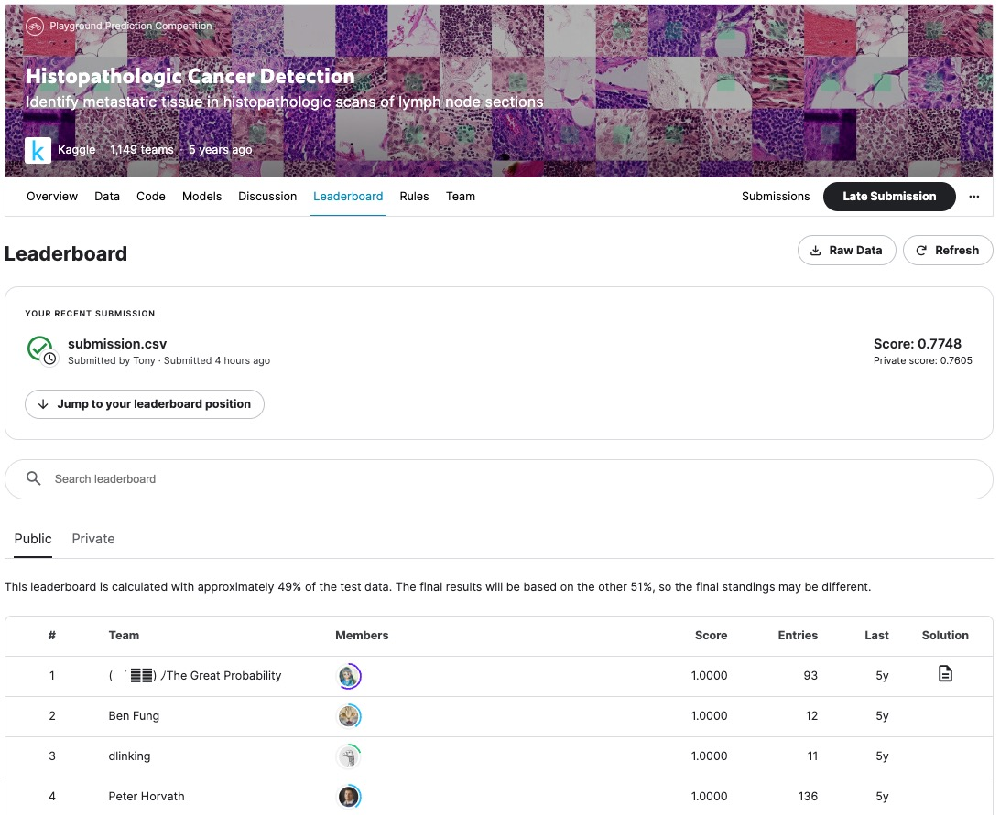

# CNN Histopathologic Classification using PyTorch

- For notebook cell outputs, please see the [version on Kaggle](https://www.kaggle.com/code/anthonyylee/cnn-histopathologic-classification-using-pytorch) as the dataset is hosted on Kaggle. 
- [Kaggle Competition](https://www.kaggle.com/competitions/histopathologic-cancer-detection/leaderboard?tab=public#)

# Overview

The notebook documents a computer vision binary classification problem. Specifically, the dataset composes of 220,025x microscopies of 96x96 pixels with corresponding labels indicating whether the center 32x32 region contains metastatic cancer cells. A convolutional neural network of 4x convolutional layers was built using PyTorch and training is done over 10x epochs with various hyperparameters.

ADAM (Adaptive Moment Estimation) was used to optimized the training along with Negative Log Likelihood (NLL) as the loss metric. The rationale for using ADAM and NLL is for their versatility to and ability to adapt to more general classification problems beyond a binary classification problem for future investigations.

The notebook has yet to implemented the desired tuning tool (Ray Tune) as a hyperparameter tuning tool and thus tuning was done manually and thus there are plenty of room for the model's performance. However, undocumented are (1) the experimentation of different CNN filter-size / layers, and (2) data batch-size, prefetch size, number of workers using the PyTorch Dataloader wrapper.

# Competition Submission

